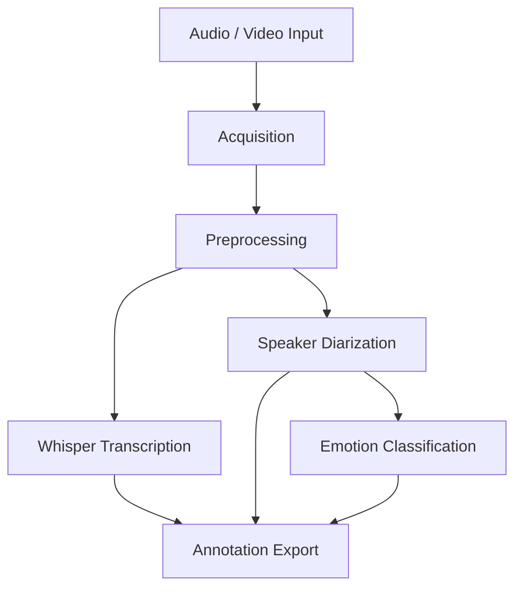

# Speech Data Processing & Annotation Pipeline

An end-to-end pipeline for ingesting audio/video, processing speech, and generating
structured annotations — built to production engineering standards.

---

## What This Pipeline Does

Takes raw audio or video as input and produces structured annotation files (JSON/CSV)
containing transcriptions, speaker segments, and emotion labels — the kind of labeled
datasets used to train production speech models.

```
Raw Audio/Video
      │
      ▼
  Acquisition        ← Download from URL / YouTube / local file
      │
      ▼
  Preprocessing      ← Resample, denoise, normalize, VAD
      │
      ▼
  Transcription      ← Whisper speech-to-text
      │
      ▼
  Diarization        ← Who spoke when (pyannote)
      │
      ▼
  Emotion            ← Emotion per speaker segment
      │
      ▼
  Annotation Export  ← Structured JSON / CSV output
```

---

## Project Structure

```
├── data/
│   ├── raw/             # Original input files (gitignored)
│   ├── processed/       # Cleaned audio (gitignored)
│   └── output/          # Final annotations (gitignored)
├── src/
│   ├── acquisition/     # Audio/video ingestion
│   ├── preprocessing/   # Audio cleaning & normalization
│   ├── transcription/   # Speech-to-text
│   ├── diarization/     # Speaker diarization
│   ├── emotion/         # Emotion classification
│   ├── annotation/      # Output generation
│   ├── logger.py        # Centralized logging
│   └── config_loader.py # YAML config reader
├── configs/
│   ├── config.yaml      # Pipeline settings
│   └── models.yaml      # Model settings
├── tests/               # Unit tests
├── scripts/             # Utility scripts
├── logs/                # Runtime logs (gitignored)
├── main.py              # Pipeline entry point
├── requirements.txt
└── .gitignore
```

---

## Setup

```bash
# 1. Clone the repo
git clone <repo-url>
cd Speech-Data-Processing-Pipeline

# 2. Create and activate virtual environment
python -m venv venv
venv\Scripts\activate        # Windows
# source venv/bin/activate   # macOS/Linux

# 3. Install dependencies
pip install -r requirements.txt

# 4. Run the pipeline
python main.py
```

> Note: Some models (pyannote, speechbrain) require a Hugging Face token.
> Set it as an environment variable: `HF_TOKEN=your_token_here`

---

## Configuration

All pipeline behavior is controlled via YAML files in `configs/`:

- `config.yaml` — paths, audio settings, log level
- `models.yaml` — model selection and inference device (cpu/cuda)

---

## Tech Stack

| Stage | Library |
|---|---|
| Audio I/O | librosa, soundfile, pydub |
| Transcription | OpenAI Whisper |
| Diarization | pyannote.audio |
| Emotion | SpeechBrain |
| Deep Learning | PyTorch, Transformers |
| Media Acquisition | yt-dlp |

## Key Features

- End-to-end speech data processing pipeline
- Modular architecture with configurable YAML-based workflows
- Automated audio/video acquisition from local files and online sources
- Audio normalization to 16kHz mono WAV for speech model compatibility
- Whisper-based speech transcription
- Speaker diarization using pyannote.audio
- Emotion classification using SpeechBrain
- Structured annotation export (JSON, CSV)
- Centralized logging and error handling
- Batch processing support
- Idempotent pipeline execution
---
## Example Annotation Output

{
  "speaker": "Speaker_0",
  "start_time": 0.00,
  "end_time": 2.54,
  "transcript": "Hello everyone",
  "emotion": "happy",
  "confidence": 0.94
}

---
## Why This Project?

Modern speech AI systems require large volumes of high-quality annotated speech data. This platform automates the process of transforming raw audio and video into structured training-ready datasets by combining speech transcription, speaker diarization, and emotion recognition into a single workflow.

The generated outputs can be used for:
- Speech-to-Text (ASR) datasets
- Text-to-Speech (TTS) training pipelines
- Conversational AI systems
- Speaker recognition research
- Emotion-aware speech applications

---

## Architecture


---

Project Status

Core pipeline implementation completed. Additional validation and performance optimization are ongoing.
---

## Future Improvements

- Distributed batch processing
- Real-time streaming inference
- Multi-language support
- Web-based monitoring dashboard
- Cloud deployment and orchestration
- Human-in-the-loop annotation review
  

## License

MIT
